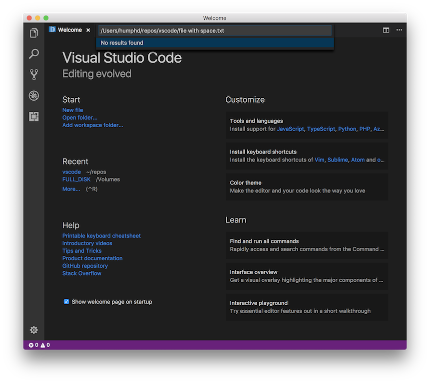
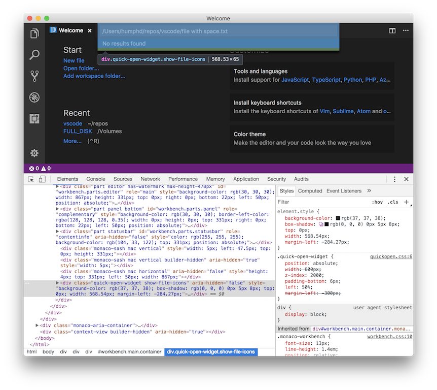
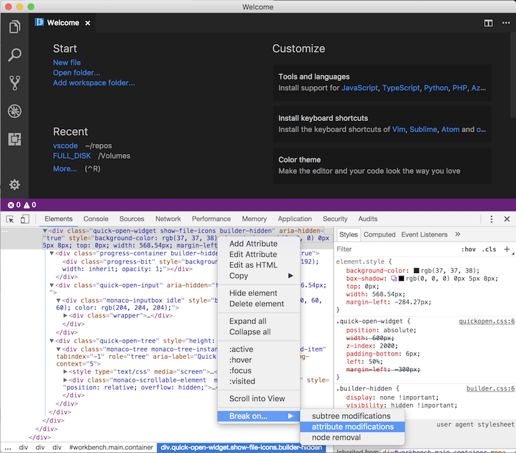
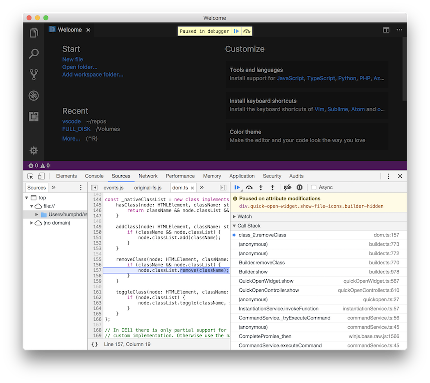
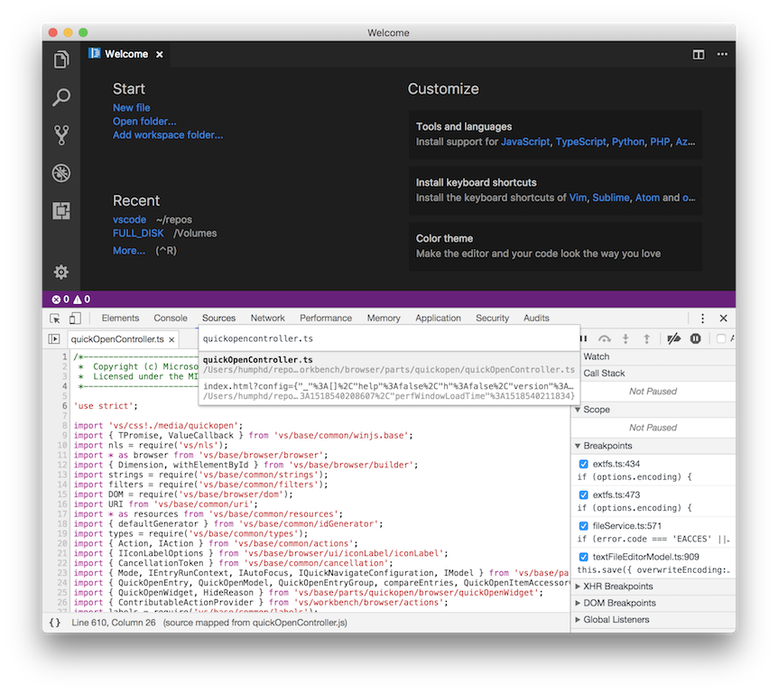
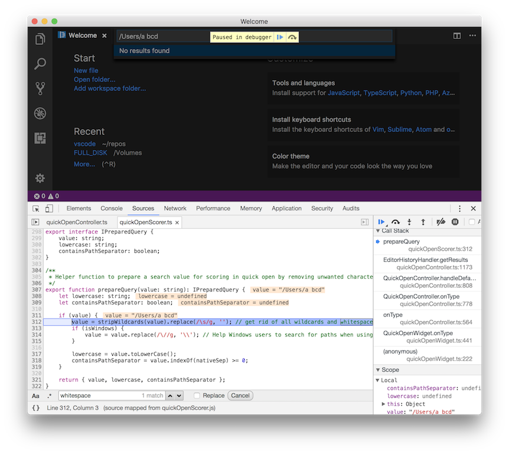
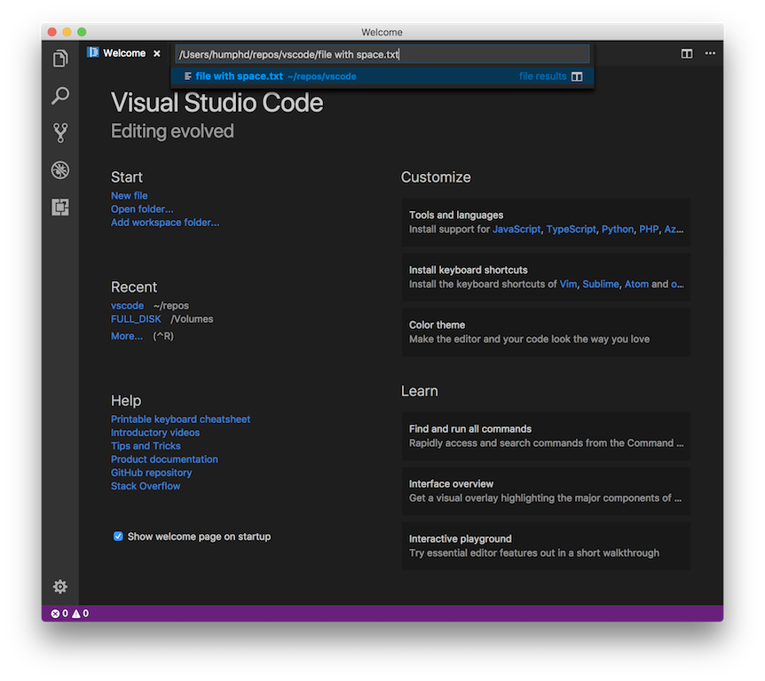

# Walkthrough: Fixing a Bug in Visual Studio Code

<p align="center">
  
</p>

Fixing a bug in a project the size of [Visual Studio Code](https://code.visualstudio.com/) might seem overwhelming at first. The following
is a so-called ["good-first-experience"](http://blog.humphd.org/why-good-first-bugs-often-arent/)
walkthrough of how one might solve a real bug.  It is meant as a
learning exercise for my open source students at Seneca, or anyone else that is
interested in getting started fixing bugs in large projects. Our goal is to break the process down and discuss the steps along the way, in
an effort to familiarize you with the process, and make it less of a magic trick
and more the kind of thing you would feel comfortable doing on your own.

NOTE: I am doing this work in an old branch of [VSCode](https://github.com/Microsoft/vscode), and modifying things
directly in the repo so that you can clone and checkout my branch if you want
to play along at home.  To do so:

```
git clone https://github.com/humphd/vscode.git
cd vscode
git checkout good-first-experience-issue-42726
```

Next, follow [the instructions](CONTRIBUTING.md) to get VSCode built on your computer.  The remainder of this walkthrough assumes that you know how to do the following:

* build vscode using `yarn run watch`
* run your built editor using `scripts/code`
* start the Chrome debugger within your editor
* run the unit tests using `scripts/test`

Please read [the instructions](CONTRIBUTING.md) before continuing.

## Finding a Bug

At the time of writing, there are [4,020 open issues](https://github.com/Microsoft/vscode/issues) in Microsoft's VSCode GitHub repo.
Finding a good first bug in this list can be hard.  Let's begin by narrowing things down, using the project's extensive set of [Labels](https://github.com/Microsoft/vscode/labels).

Often I find that students are drawn to working on new features--VSCode has
[2,295 such issues right now](https://github.com/Microsoft/vscode/labels/feature-request).
They like imagining how some new option or UI widget will work.  However, I'm going to suggest that these are not ideal for your first foray into a new codebase.  There are a few reasons why I suggest you avoid them at first.

1. New features are often controversial: many people may want them, but maintainers may not agree that they are necessary. Starting off in the centre of an argument over direction in a project is not where you want to be.
2. Adding new functionality literally requires writing *new* code. To do one typically needs an understanding of the *existing* code, its internal APIs, tests, conventions, etc. This kind of expertise can be acquired; but it's likely that you (or I) don't have it yet.

Instead of working on *new* code, I'm going to argue that the best place to begin
is working on *existing* code, and this means fixing a bug.  As I write this,
there are [803 issues labelled 'bug'](https://github.com/Microsoft/vscode/labels/bug) in VSCode.  There's a few things I like about an issue with an explicit 'bug' label on it:

1. It means it's been triaged (ie., read and evaluated) by the project maintainers, and identified as being about a defect of some kind in the code.
2. It means that the misbehaving code is contained somewhere in the existing code and can be found if you go looking.  Unlike new code, which has to be invented, bugs in existing code are discoverable through careful study.

When picking a good bug for the purposes of getting started on a project, try to
find one that has a set of reproducable steps, often called Steps To Reproduce (STR).

Looking through the list of available bugs, I notice one that looks perfect for our needs:

* https://github.com/Microsoft/vscode/issues/42726 "Open File: unable to open a file with spaces in name if absolute path is provided"

Let's try to figure out what is causing this bug.

## Reproducing the Bug

Before we can fix it, we have to be able to recreate the bug on our own machine.
This bug relates to VSCode's **Quick Open** feature, which is a togglable UI
component that allows us to enter paths and open files.  When entering an **absolute path** that contains spaces, no results are reported.

To recreate this bug, we need a filename with a space.  I've created one in this
branch named `file with space.txt`.  Using its absolute path, we can start our
VSCode build and try the following steps:

1. Open **Quick Open** (CMD+p or CTRL+p depending on your OS)
* Paste the absolute path into input box.  On my machine that's `/Users/humphd/repos/vscode/file with space.txt`
* Notice the displayed results says `No results found`



## Finding the Related Code

Now that we can successfully recreate the bug, it's time to try and locate the
code that causes the issue.  Where to begin?  We have a few options.

First, we have some visible (and inspectable/debuggable) UI that we can use to
help locate the problem.  We know that pressing `CMD+p`/`CTRL+p` toggles the
**Quick Open** widget.  That's really helpful, because it gives us an action we
can take in order to try and isolate the code associated with **Quick Open**.

Second, we have a technical name, **Quick Open**, that we can use to search within the code.  Likely the code related to **Quick Open** uses that name somewhere within it.  There's no guarantee, but it's a logical starting point.

Let's try and us the UI to help us find our code.  If we start the debugger in our editor, we can use the Inspector and trigger the Quick Open widget in order to locate it in the DOM:



Using the DOM Inspector, we can find the Quick Open Widget in the DOM.  Toggling
the widget open/closed also shows that a class, `builder-hidden` is being added/removed:


Open:
```html
<div class="quick-open-widget show-file-icons" aria-hidden="false" style="background-color: rgb(37, 37, 38); box-shadow: rgb(0, 0, 0) 0px 5px 8px; top: 0px; width: 568.54px; margin-left: -284.27px;">
```

Closed:
```html
<div class="quick-open-widget show-file-icons builder-hidden" aria-hidden="true" style="background-color: rgb(37, 37, 38); box-shadow: rgb(0, 0, 0) 0px 5px 8px; top: 0px; width: 568.54px; margin-left: -284.27px;">
```

Knowing this, it would be interesting to know which code is responsible for
adding/removing this class.  We can use a **DOM Mutation** breakpoint to accomplish this: right click on the `quick-open-widget` element in the debugger, and go to the last item in the context menu, `Break On... > attribute modifications`



Now we can re-trigger the Quick Open widget using `CMD+p`/`CTRL+p`, and immediately, we are dropped into the debugger:



The current frame in the debugger is not really interesting to us (i.e., it is
altering the classnames on the element).  However, what *is* intersting is the
call stack we get:

```
class_2.removeClass (dom.ts:157)
(anonymous) (builder.ts:773)
(anonymous) (builder.ts:772)
Builder.removeClass (builder.ts:770)
Builder.show (builder.ts:978)
QuickOpenWidget.show (quickOpenWidget.ts:567)
QuickOpenController.show (quickOpenController.ts:610)
(anonymous) (quickopen.ts:27)
InstantiationService.invokeFunction (instantiationService.ts:57)
CommandService._tryExecuteCommand (commandService.ts:56)
(anonymous) (commandService.ts:45)
CompletePromise_then (winjs.base.raw.js:1566)
CommandService.executeCommand (commandService.ts:45)
AbstractKeybindingService._dispatch (abstractKeybindingService.ts:165)
(anonymous) (keybindingService.ts:316)
```

This vertical slice into the VSCode is interesting, and we can already learn a lot
just by examining the function names and paths.  For example, at the bottom of the stack we can see our keypress in `keybindingService.ts` and `abstractKeybindingService.ts`.  As we move up, this is wrapped in a Command object, which gets invoked.  At the very top of the stack, the code looks like it's doing things to the DOM, and likely not interesting to us for the purposes of our bug.

However, in the middle, there are three frames that look promising:

* [`quickOpen.ts`](src/vs/workbench/browser/parts/quickopen/quickopen.ts)
* [`quickOpenController.ts`](src/vs/workbench/browser/parts/quickopen/quickOpenController.ts)
* [`quickOpenWidget.ts`](src/vs/base/parts/quickopen/browser/quickOpenWidget.ts)

We now have some logical starting points for jumping into the code.

## Reading Code

Fixing this bug is going to require us to modify something in the existing code.
However, touching the code doesn't mean we need to understand all of it.  A lot of
times I see students start looking for `main()` in a big program, and trying to
trace how everything works.  This approach might have worked in the past for small programs.  But with code as large as VSCode, we need a different strategy.

Here, the code is written in a modular form, and fixing code in one part of the app shouldn't require us to know anything about other parts.  Depending on the fix
you're doing, you may need to understand the interaction of code across a set of modules, classes, files, etc.  But don't begin there.  Start by ignoring as much as you can, and zeroing in on the problem; to do anything else will quickly overwhelm you with details that may not be necessary in the current context.

Above we found 3 files that seem like logical starting points for our exploration.
Let's start by quickly scanning them to understand what they do.

First we have [`src/vs/workbench/browser/parts/quickopen/quickopen.ts`](src/vs/workbench/browser/parts/quickopen/quickopen.ts).  This file seems to be
responsible for registering various commands related to showing the Quick Open
widget.  It also defines a series of `Action`s, from Navigate Next to Navigate Previous, etc.  One interesting thing I notice is that this code refers to `quickOpenService` and `IQuickOpenService`.  These might be interesting to explore later on.

Second we have [`src/vs/workbench/browser/parts/quickopen/quickOpenController.ts`](src/vs/workbench/browser/parts/quickopen/quickOpenController.ts). This file is much larger, and seems to have a lot of the core functionality of the Quick Open UI.  This makes sense, as the name implies it's a [controller in the MVC pattern](https://en.wikipedia.org/wiki/Model%E2%80%93view%E2%80%93controller). Scanning
through the code, I see event handlers like `onType`, which is trimming leading/trailing whitespace, and various code paths dealing with `results`, which is something to which I'll likely return.

Finally, we have [`src/vs/base/parts/quickopen/browser/quickOpenWidget.ts`](src/vs/base/parts/quickopen/browser/quickOpenWidget.ts). This file seems to be
responsible for the presentation of the Quick Open UI, its styles, HTML components, interaction with the DOM, etc.  Again, the name gave us a clue, with
the use of `Widget` implying UI related code.

## Making Some Guesses

At this stage, we have enough of a picture to start making some guesses, and trying to further narrow our search.  Assuming that the code we are looking for
is somehow connected to these three files (it might not be), of the three the most
likely candidate is [`quickOpenController.ts`](src/vs/workbench/browser/parts/quickopen/quickOpenController.ts).  Let's set some traps, and see if we can catch anything.

Earlier I said that it was interesting that there was already code for dealing with whitespace in `onType`:

```ts
private onType(value: string): void {

  ...

  // Remove leading and trailing whitespace
  const trimmedValue = strings.trim(value);
```

This seems like as good a place as any to set a breakpoint and begin walking through the code's execution.  In the debugger's **Sources** tab, which also has a Quick Open widget, press `CMD+p`/`CTRL+p` and type `quickOpenController.ts` to locate and open the file:



Next, scroll down to line 755 and set a breakpoint

```ts
// Remove leading and trailing whitespace
const trimmedValue = strings.trim(value);
```

Re-run the editor, open the Quick Open widget and start typing.  Immediately we're dropped into the debugger at our breakpoint, and can now start stepping into the code. As I do, and follow the flow through `handleDefaultHandler()` and `EditorHistoryHandler.getResults()`, I get to line 1173:

```ts
// Massage search for scoring
const query = prepareQuery(searchValue);
```

My text from the Quick Open widget goes into this with a space in the middle, but
what comes out has no spaces.  I need to see what `prepareQuery()` is doing.  Stepping into this code, I can see exactly where my spaces are going:



Here in [`src/vs/base/parts/quickopen/common/quickOpenScorer.ts`](src/vs/base/parts/quickopen/common/quickOpenScorer.ts) and the `prepareQuery()` function, my test text is being changed from `"/Users/a bcd"` to `"/Users/abcd"`
because of this regex:

```ts
value = stripWildcards(value).replace(/\s/g, ''); // get rid of all wildcards and whitespace
```

Finally, this is our bug!

## Making a Fix

At this stage, we know where our problem is.  Fixing it should be easy, right? Maybe.
Fixing this bug, without taking into account the other cases that VSCode has to deal with, could be as simple as just removing the call to `replace(/\s/g, '')`.
However, this might cause other issues to crop up (i.e., it might have been put here for a reason).

I suggest you start with the obvious and most simple thing possible, and work up from there.  In this case, let's just remove that regex and see if it fixes things.  After changing the file, rebuilding, and restarting the editor, I see this with my original test case:



It works, and now I get back the result I expect.

## Did We Break Anything Else?

Now that we have things working, it's worth checking to see if we've broken any other code.  We'll do that by running the tests:

```
3865 passing (22s)
  1 failing

  1) Quick Open Scorer prepareSearchForScoring:

      AssertionError: ' fa ' == 'fa'
      + expected - actual

      - fa
      +fa
```

Indeed, we've broken something, and at least one test is now failing. We can
use `git` to find this test:

```
git grep prepareSearchForScoring
src/vs/base/parts/quickopen/test/common/quickOpenScorer.test.ts:        test('prepareSearchForScoring', function () {
```

This leads us to ... and the failing test looks like this:

```ts
test('prepareSearchForScoring', function () {
  assert.equal(scorer.prepareQuery(' f*a ').value, 'fa');
  assert.equal(scorer.prepareQuery('model Tester.ts').value, 'modelTester.ts');
  assert.equal(scorer.prepareQuery('Model Tester.ts').lowercase, 'modeltester.ts');
  assert.equal(scorer.prepareQuery('ModelTester.ts').containsPathSeparator, false);
  assert.equal(scorer.prepareQuery('Model' + nativeSep + 'Tester.ts').containsPathSeparator, true);
});
```

The first assertion is the one that's failing, but it also looks like it has bailed
early on this first failure, and that other assertions are also going to fail.
There are a bunch of tests here that assume a space in a filename will get removed.  However, none of the ones that will fail contain path separators, which is interesting.

At this point we have a few choices:

1. Update the tests to reflect our new code logic
2. Rework our code change to adhere to what's in these tests, but add some new ones for the new logic
3. Ask someone in the community, either via GitHub or Slack

Before doing anything else, let's see if we can glean any information from
git about *why* this code was written the way it was.  Maybe there is a bug
that will explain why they are removing the whitespace.  We can use `git blame`
and look at the final lines of this file (that's where our tests are):

```
git blame src/vs/base/parts/quickopen/test/common/quickOpenScorer.test.ts | tail -n 8
342f81d2483 src/vs/base/parts/quickopen/test/common/quickOpenScorer.test.ts (Benjamin Pasero         2017-10-16 11:54:37 +0200 815) 	test('prepareSearchForScoring', function () {
342f81d2483 src/vs/base/parts/quickopen/test/common/quickOpenScorer.test.ts (Benjamin Pasero         2017-10-16 11:54:37 +0200 816) 		assert.equal(scorer.prepareQuery(' f*a ').value, 'fa');
342f81d2483 src/vs/base/parts/quickopen/test/common/quickOpenScorer.test.ts (Benjamin Pasero         2017-10-16 11:54:37 +0200 817) 		assert.equal(scorer.prepareQuery('model Tester.ts').value, 'modelTester.ts');
342f81d2483 src/vs/base/parts/quickopen/test/common/quickOpenScorer.test.ts (Benjamin Pasero         2017-10-16 11:54:37 +0200 818) 		assert.equal(scorer.prepareQuery('Model Tester.ts').lowercase, 'modeltester.ts');
342f81d2483 src/vs/base/parts/quickopen/test/common/quickOpenScorer.test.ts (Benjamin Pasero         2017-10-16 11:54:37 +0200 819) 		assert.equal(scorer.prepareQuery('ModelTester.ts').containsPathSeparator, false);
342f81d2483 src/vs/base/parts/quickopen/test/common/quickOpenScorer.test.ts (Benjamin Pasero         2017-10-16 11:54:37 +0200 820) 		assert.equal(scorer.prepareQuery('Model' + nativeSep + 'Tester.ts').containsPathSeparator, true);
be10b09e63e src/vs/base/parts/quickopen/test/common/quickOpenScorer.test.ts (Benjamin Pasero         2017-10-10 17:47:17 +0200 821) 	});
7eff5f7f146 src/vs/base/test/common/scorer.test.ts                          (Benjamin Pasero         2015-12-10 08:06:03 +0100 822) });
```

Here we see that these assertions were added in [342f81d2483](https://github.com/Microsoft/vscode/commit/342f81d2483d79bd86e6722d7976713364bea367), at the same time as the code we're changing.  It's too bad there isn't more
to go on in this case (e.g., we don't have a bug, or a series of fixes with
discussion about the changes, etc.)

Let's alter our code so it only does this new logic if we're give a file path
(i.e., contains path separators).  We'll just move the `containsPathSeparator` code earlier, then use it to wrap the regex in an `if` check:

```ts
/**
 * Helper function to prepare a search value for scoring in quick open by removing unwanted characters.
 */
export function prepareQuery(value: string): IPreparedQuery {
	let lowercase: string;
	let containsPathSeparator: boolean;

	if (value) {
		value = stripWildcards(value); // get rid of all wildcards
		containsPathSeparator = value.indexOf(nativeSep) >= 0;

		if (!containsPathSeparator) {
			value = value.replace(/\s/g, ''); // Strip whitespace if not part of file path
		}
		if (isWindows) {
			value = value.replace(/\//g, '\\'); // Help Windows users to search for paths when using slash
		}

		lowercase = value.toLowerCase();
	}

	return { value, lowercase, containsPathSeparator };
}
```

This updated version of the fix causes the previously failing test(s) to pass.

## Adding Tests

When we change the way code works, we should do more than just fix breaking tests:
we also need to *add* new tests.  Let's add a test for the case of a space in a file path.  Using the previous assertions as a guide, we can do this:

```ts
assert.equal(scorer.prepareQuery(nativeSep + 'Model Tester.ts').value, nativeSep + 'Model Tester.ts');
```

Re-running the tests, this works as expected.  We've used `nativeSep` like the other assertion in this test in order to deal with `/` vs. `\` on Windws vs. Linux/macOS.

## Conclusion

At this point we could create a Pull Request and get some feedback on our changes.
Likely there are things to be fixed, perhaps other cases we haven't considered above.

However, the point of this walkthrough was to practice how to go from a set of
steps and to reproduce a bug toward finding the right spot to make a fix, and doing it.  Different bugs will require different approaches, but we've been able
to try a lot of common techniques.

While lots of bugs may be beyond your current knowledge of a codebase, don't get
overwhelmed and assume you can't contribute.  Many bugs are solvable with enough
research and persistence.

